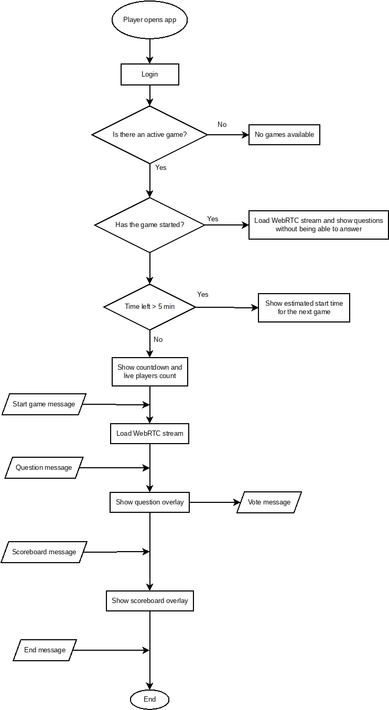

# RTQuiz docs

## Design choices

- All questions have **strictly** 4 possible answers. Only **one** can be correct.
- One player can only answer once per question.
- Once a player selects a wrong answer they can't anwser any more question in that game
- The number of questions per game is custom and can be different per game.
- Once the game has begun new players won't be allowed to answer any remaining questions, but will be able to watch the video stream.
- Only one game can be active in each instance of the server.

## App flow

